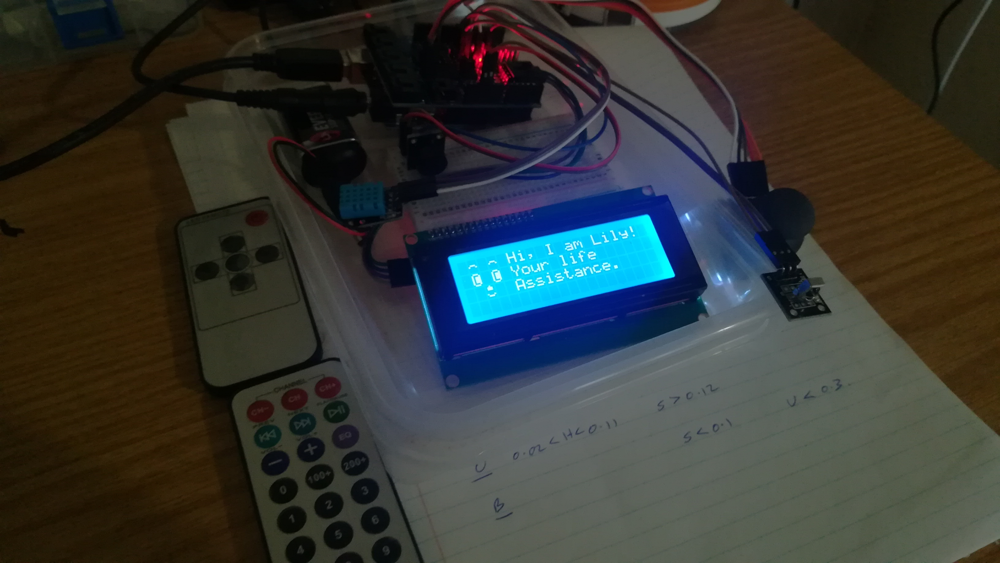

# Life Assistance in Embedded System
A life assistance building on Arduino devices. Demo is shown below:

## Hardware list

Arduino UNO

Arduino Sensor Shield V4.0

16x2 LCD display with I2C interface

Infrared remote & Emitter

Temperature & Humidity Sensor

Thumb Joystick

## Executed Demo 
The demo video is [here](https://www.youtube.com/watch?v=01gUj48ilqY). Welcome suggestions and questions

